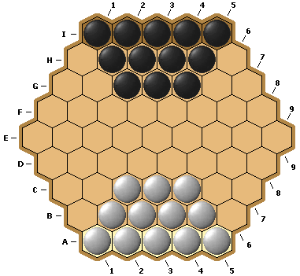
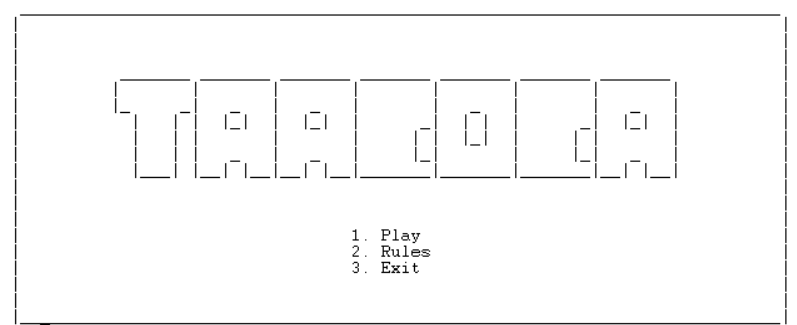
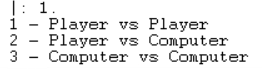
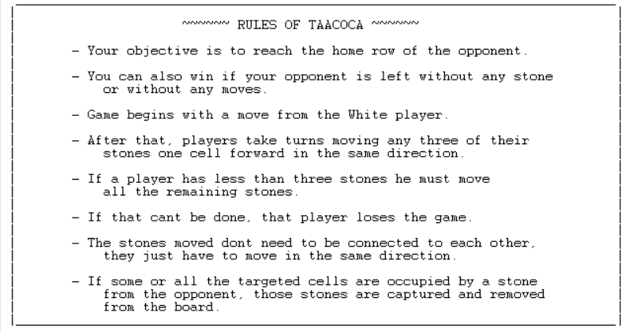
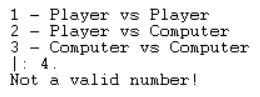
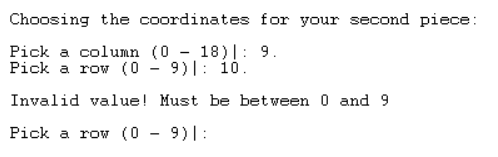
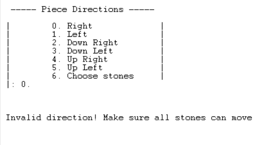

# PFL 2022/2023 - TP2

## Group: Taacoca_1

| Name             | Number    | Contribution                |
| ---------------- | --------- | --------------------- |
| Afonso José Pinheiro Oliveira Esteves Abreu    | 202008552 | 33 %  |
| Afonso da Silva Pinto    | 202008014 | 33 %  |
| Maria Carlota Gomes Ribeiro Matos Leite    | 202005428 | 33 %  |

## Installation and Execution

To run our game follow the following steps:

- Install and run SICStus Prolog.
- Go to File > Working Directory and navigate to the *src* folder where you downloaded the code.
- Go to File > Consult and select the file [*Taacoca.pl*](src/Taacoca.pl).
- **Alternatively:** run `consult('path\to\Taacoca.pl').`
- Type `play.` into the SICStus console and the game will start.

## Taacoca

Taacoca is a two-player abstract board game played on a hexagonal board that was invented by Víkingur Fjalar Eiríksson in 2009.

### Board

Taacoca is a board game similar to games like chess or checkers that is played on a hexagonal board with five cells on each side. The top row is the home row for the player with the black stones and the bottom row is the home row for the player with the white stones.

At the beginning of the game, each player has 12 stones in the following positions:



### Objective of the Game

The objective of Taacoca is to reach the opponent's Home row with one of the player's stones, or to capture all of the opponent's stones. Since there are no draws, one player must win and the other player must lose in each game.

There are a few different strategies that players might use in Taacoca. One common strategy is to try to control the center of the board, since this can give you more options for movement and make it harder for your opponent to reach your Home row. Players might also try to create lines of stones that are difficult for the opponent to break through, or to surround and capture the opponent's stones.

### How to play

- Game begins with a move from the White player.
- After that, players take turns moving any three of their stones one cell forward in the same direction.
- If a player has less than three stones he must move all the remaining stones.
- If that can't be done, that player loses the game.
- The stones moved don't need to be connected to each other, they just have to move in the same direction.
- If in any move the targeted cells are occupied by a stone from the player, the move is not valid and cannot be completed.
- If some or all the targeted cells are occupied by a stone from the opponent, those stones are captured and removed from the board.

[Source and Rules](https://www.iggamecenter.com/en/rules/taacoca)

## Game Logic


### Game state representation


#### Board

To represent our board we use a list of lists.

- Initial State:

```
    [
    ['0', '1', '2', '3', '4', '5', '6', '7', '8', '9', '0', '1', '2', '3', '4', '5', '6', '7', '8'],
    ['1', ' ', ' ', ' ', '|', 'o', '|', 'o', '|', 'o', '|', 'o', '|', 'o', '|', ' ', ' ', ' ', ' '],
    ['2', ' ', ' ', '|', '_', '|', 'o', '|', 'o', '|', 'o', '|', 'o', '|', '_', '|', ' ', ' ', ' '],
    ['3', ' ', '|', '_', '|', '_', '|', 'o', '|', 'o', '|', 'o', '|', '_', '|', '_', '|', ' ', ' '],
    ['4', '|', '_', '|', '_', '|', '_', '|', '_', '|', '_', '|', '_', '|', '_', '|', '_', '|', ' '],
    ['5', '_', '|', '_', '|', '_', '|', '_', '|', '_', '|', '_', '|', '_', '|', '_', '|', '_', '|'],
    ['6', '|', '_', '|', '_', '|', '_', '|', '_', '|', '_', '|', '_', '|', '_', '|', '_', '|', ' '],
    ['7', ' ', '|', '_', '|', '_', '|', '+', '|', '+', '|', '+', '|', '_', '|', '_', '|', ' ', ' '],
    ['8', ' ', ' ', '|', '_', '|', '+', '|', '+', '|', '+', '|', '+', '|', '_', '|', ' ', ' ', ' '],
    ['9', ' ', ' ', ' ', '|', '+', '|', '+', '|', '+', '|', '+', '|', '+', '|', ' ', ' ', ' ', ' ']
    ]
```

#### Player

Regarding the players, we are representing each white stone with a character `+` and each black stone with a character `o`.

### GameState Visualization

#### Board - [display.pl](src/display.pl)

The initial board is displayed using the predicate `print_Initboard(Board)`.

The intermediate board is displayed during the game with the predicate `print_board(Board)`.

Below is the visualization for the game state showed in the [GameStateRepresentation](#Board):

- Initial State:

```

0 1 2 3 4 5 6 7 8 9 0 1 2 3 4 5 6 7 8
1       | o | o | o | o | o |
2     | _ | o | o | o | o | _ |
3   | _ | _ | o | o | o | _ | _ |
4 | _ | _ | _ | _ | _ | _ | _ | _ |
5 _ | _ | _ | _ | _ | _ | _ | _ | _ |
6 | _ | _ | _ | _ | _ | _ | _ | _ |
7   | _ | _ | + | + | + | _ | _ |
8     | _ | + | + | + | + | _ |
9       | + | + | + | + | + |

```

#### Menus - [display.pl](src/display.pl)

When the user runs the program, they can see the main menu, with the title of the game and 3 options:

- Play
- Rules
- Exit



If `Play` is selected, the game modes bellow are shown as follows:

- Player vs Player
- Player vs Computer
- Computer vs Computer



If `Rules` is selected, the game rules are displayed:



#### Input validation - [input.pl](src/input.pl) & [utils.pl](src/utils.pl)

To avoid unexpected behaviour in case of invalid user inputs, we implemented user input validation that alerts the user if their input is not valid and asks them to try again.

#### Menu input validation [input.pl](src/input.pl)

In this case, user input is invalid either when it's out of range of the options or it's of a different type altogether.

We used `read_number(Min, Max, X)` in each menu to verify if the input is within the range estipulated.




#### Gameplay input validation [logic.pl](src/logic.pl)

We have several functions that validate the user input, such as `get_valid_coordinates(Board, Player, X, Y)`, `check_coord(Board, Player, X, Y)` and `traverse_matrix(Matrix, X, Y, Char)`.






### List of valid moves

In Taacoca, it's very difficult to predict any moves, since most are made by the player or the computer and the moves are made with 3 pieces at a time.

### End of Game [logic.pl](src/logic.pl)

`game_over(Board, Player)` checks if a player has reached the opponents home row or has eaten all enemy stones and the player that wins is displayed.

### Board evaluation [logic.pl](src/logic.pl)

`game_over(Board, Player)` checks if the game has ended or not.

### Computer move [bot.pl](src/bot.pl)

Although we didn't implement the `choose_move` predicate, we adapted the functions used in the player moves to create a bot that randomly chooses a move.

## Conclusions

We had a positive experience working with Prolog on this project, althought it's a very different language than the ones we're used to.

Limitations:

- Missing intermediate and final states.
- In SICStus Prolog, the program doesn't recognize the `random_between` function, therefore we can only run our game on the terminal.

For future improvements, maybe we could add more levels of difficulty and add other features to make the game more visually appealing or easier to play.

## Bibliography

- [SICStus Prolog documentation](https://sicstus.sics.se/);
- Moodle slides;